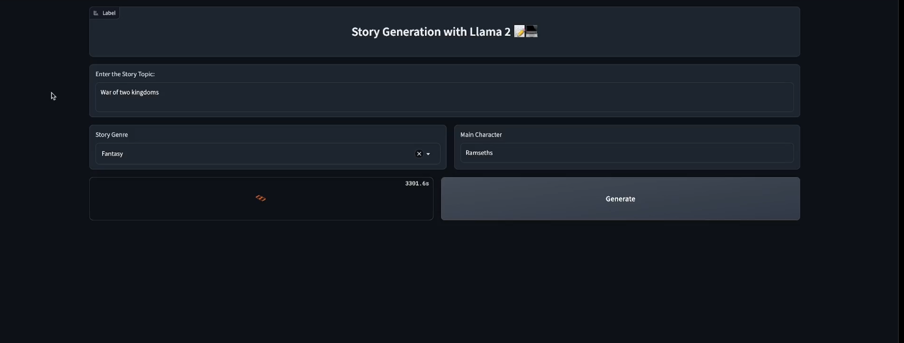

# 💻 Story Generation with Llama 7B Chat

Llama 2 was pretrained on publicly available online data sources.
The fine-tuned model, Llama Chat, leverages publicly available instruction datasets and over 1 million human annotations.

## 🚀 App

## 🎯 Features

- Story Generator with different genres 
- Model Llama-7B
- LangChain for Prompt Template
- Interface designed with Gradio

## 📝 Instructions for Use

- [👉🏻 Request access to download Llama 2 in Meta AI](https://ai.meta.com/resources/models-and-libraries/llama-downloads/).
- Place the Llama-7B model in a folder called models
- Create an environment with Anaconda and Python 3.8 
- Install the packages from requirements.txt

Happy problem-solving! 🎉

